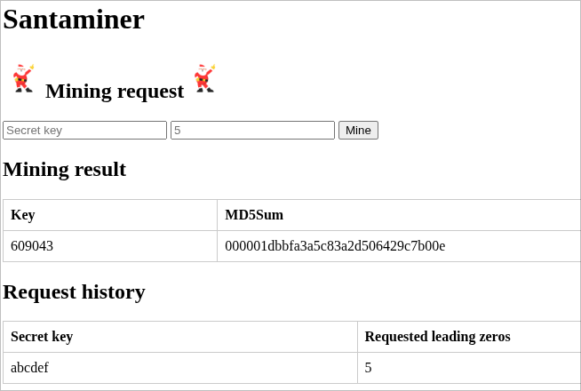

# Santa Miner

Some fun I had with [Advent of Code 2015, Day 4](https://adventofcode.com/2015/day/4)

This project consists of a go-backend and a simple html/javascript frontend.



## How to run (backend)
```sh
cd backend
go run aoc.go
```

This will start the "server" (on port 2512 because why not)

## How to run (frontend)

After running the backend, open the frontend directory and open index.html in your web browser.

Now you can enter your secret key and the number of leading zeros required, click "mine" and wait for the answer to pop up.

## Disclaimer

I am not a go/backend programmer. So this code is less than ideal.
